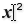
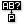

# [🦏 Rhino Secrets](https://runxel.github.io/rhino-secrets/)
A collection of cool stuff and lesser known facts on Rhino & Grasshopper you might or might not know.

<hr>

## Rhino 🦏

- [Good model practices & techniques](./model-practices.md)
- [Troubleshooting Guide](./troubleshooting.md)


### Explain NURBS to me
Go and see this wonderful explanation: [«Nurbs is just an acronym»](https://wordsandbuttons.online/nurbs_is_just_an_acronym.html)  


### Symbols in command line
Ever wondered what the specials chars in commands meant? Or are you always forgetting?  

| Char | Meaning |
| ---  | --- |
| `*`  | Causes the command to repeat automatically without pressing <kbd>Enter</kbd> to restart. (used in macros) |
| `!`  | Cancels the previous command. |
| `_`  | Runs command as English command name. |
| `-`  | Suppress any dialog box. |
| `'`  | The apostrophe tells that next command is a nestable command. (geometry creations are never nestable) |
| `/`  | If the first character in a toolbar macro is not "!" and the last character is" /", the script runs on the command line without <kbd>Enter</kbd>, so more information can be added. |
| `~`  | Suppresses command options for clutter free command feedback. |
| `;`  | Comment. (used in macros) |


### Tolerances
What are they? How are they important? Do _I_ have to do anything?  
All those questions are perfectly answered in the [McNeel Wiki](https://wiki.mcneel.com/rhino/faqtolerances).

Rule of thumb:  
Use a tolerance setting one order of magnitude tighter than (1/10 of) your smallest modeled detail.  
In general keep the absolute tolerance setting in the range of `0.01` to `0.0001`. Never set it below `1.0e-5` – chrashes might occur and you pay with slow computing speed. If you need a tighter tolerance, use smaller units instead.


### Find layer
Every so often you are in need of finding the layer the object is in – i.e. it's precise location in the layer tree. Of course we can see the layer name of the selected object in the statusbar, but when working with many (and possibly similar named) layers this information alone is sometimes not enough.  
With the wanted object selected go to your layers panel and click on the hammer icon, then choose "Select Object Layer". Rhino will unfold the layer structure for you and and highlight the right layer.


### Fast layer assign
To change the layer of the selected object(s) click on the layer name in statusbar and choose another layer.  
Since this pop-up is actually a full-fledged layer manager you can also set your current layer (when no object is selected), or hide/show and lock/unlock layers.


### Disable a specific layer
Often enough you want to disable a whole layer based on your selection. But going into a deeply nested layer tree is hard, so just use `_OneLayerOff`.  


### Too many layers to handle?
Try the [layer state manager](https://docs.mcneel.com/rhino/5/help/en-us/commands/layerstatemanager.htm). It will save you tons of time of hiding (and showing) certain layers.


### Different looking
Take advantage of the possibility to assign a display mode to an object via `_SetObjectDisplayMode`.  


### Fast Osnap
Right-mouse click on an osnap filter in the panel to check that one and uncheck all the others. Right click again to restore the state before.


### Osnaps reloaded
Pressing and holding <kbd>shift</kbd> to reverse the effect of your current Ortho setting.  
Pressing and holding <kbd>alt</kbd> suspends any persistent Osnaps without unchecking them.


### Easy dragging
Long-press LMB on an object to drag and Rhino will find the closest snapping point and use that one while dragging.


### Fast angle snap
Hover your mouse over a point during a command and press <kbd>Tab</kbd> to lock the current angle.


### Snap to locked objects
Sometimes you want to snap to locked objects, other times you don't.  
Just go to `Tools > ObjectSnaps` and (un)check `snap to locked objects` – or type `SnapToLocked`. Tip: A good item to put on a custom button!


### Quick angles
While using a drawing command like `_pline`, you can choose a relative angle to your point by typing in `<angle`. For example: `<35`


### Elevator mode
When drawing a polyline <kbd>ctrl</kbd> + <kbd>click</kbd> on your previous point to draw vertical regarding the Cplane.


### Elevate during drag
Everybody knows <kbd>shift</kbd> for constraining objects orthogonally on plane; use <kbd>shift</kbd> + <kbd>ctrl</kbd> and you can lock it vertically.


### Distance constraint
When prompted for a second point you can also just type in a distance and enter. That constrains the distance from the first point. Then click on something in the correct direction and you're done!


### Select Last
While many operations unselect objects that have just been created or modified, `_SelLast` gives an instant access to them.  
(Mind that the default option `DeselectOthersBeforeSelect` is set to `Yes`. Having changed it once the option will stick.)


### Select specific
`_SelectionFilter` gives you a dockable menu which let you omit whatever geometry types you want from being selected.


### Select in dense areas
When selecting in dense environments, you often want to select around something, but then once clicking to drag your selection window, it already selects something and you end up dragging geometry instead. This can be avoided using the <kbd>alt</kbd> button while making the selection.


### Coordinates
When Rhino prompts for a "next point", typing `.x`, `.y` or `.z` (or even combinations like `.zx`) constrains the following point input to that coordinate type. Very useful when selecting points in different viewports.


### Easy Polysurface editing
Give `_SolidPtOn` a try.  


### Move on
... with `_MoveUVN`. Works beatifully with `_SelU` and `_SelV`.


### Surfaces want to be one
`_MergeAllFaces` command to turn _coplanar polysurface faces_ into one face.  

`_MergeSrf` command to join surfaces together without making a polysurface (makes a new single surface, even if surfaces are not co-planar; works only with untrimmed surfaces).


### Rebuild your edges
If you use the `_RebuildEdges` command it will restore the original trimmed or non-trimmed edges of a surface. This will vastly reduce the amount of newly added control points of most surfaces that are extruded from- or matched to the surface with rebuilt edges.  
You can use this macro with polysurfaces:
```
! _Explode
_RebuildEdges _Enter
_Join
```


### To Infinity...
... and beyond. Use `_IPlane` (alias `ip`) any time you need a plane – to trim with, intersect, Boolean operations, etc. You can even `_FilletSrf` to an IP!


### Batch delete Blocks
If you import files from other CADs you mostly end up with a lot of block definitions. If you try to delete layers you will get a pesky message that you have to delete those block definitions first, before you can delete the layer.  
That's where the `Purge` [command](http://docs.mcneel.com/rhino/mac/help/en-us/index.htm#commands/purge.htm?Highlight=purge) comes in handy. You can delete all _unused_ block definitions, dimension annotation styles, groups, hatch patterns, layers, linetypes, and materials.


### Gumball galore
Use <kbd>shift</kbd> + <kbd>ctrl</kbd> + <kbd>left click</kbd> to select the faces or edges of polysurfaces. You can then use the gumball to move/scale/rotate the selection.  

Press <kbd>alt</kbd>, then drag gumball arrow to make a copy.  

<kbd>Shift</kbd> + drag gumball scale box to scale in all directions.  

Scale numerically with a value of `0` in one axis using the Gumball to get the same result as `_SetPt_`.  
Use `-1` for fast mirroring in place.  

<iframe title="vimeo-player" src="https://player.vimeo.com/video/260472052" width="640" height="360" frameborder="0" allowfullscreen></iframe>


### Group-on
<kbd>Ctrl</kbd> + <kbd>shift</kbd> click on an object in a group to select that single object without losing the group. 


### They see me rollin'
<kbd>Ctrl</kbd> + <kbd>shift</kbd> + <kbd>RMB-drag</kbd> rotates the camera around the cursor (as long the cursor is hovering over any geometry).  


When spinning the view with RMB-drag, press/hold <kbd>shift</kbd> to limit spin to dominant initial rotation axis.


### Perspective is the way to go
With `_OneView` you get dynamic CPlanes in your perspective viewport.  


### Calibrate your scale
If you're projecting your drawing and want to set it to a specific usable scale, you should set your scale (monitor dependent) via `_Zoom1To1Calibrate`.


### Get the ZBuffer
With `_ShowZBuffer` you can view a z-buffer output in your viewport. Use the command again to exit the view. Sadly there is currently no way to set a custom render distance – it will be calculated automatically based on the geometry in your scene.  


### Render mesh
Sometimes it might be necessary to see the render mesh of an object. You could achieve this by typing in `_ShowRenderMesh`, but a better way is the command `_ToggleRenderMesh`. This way you can use the same command for showing and hiding the render mesh. Both commands are not available by menu or toolbar, so it might be helpful to create it.

To get a 'physical' access use `_ExtractRenderMesh`, which gives you, well, the polygonal render mesh. This also works on any applied render mesh properties, like [_Thickness_](https://docs.mcneel.com/rhino/6/help/en-us/properties/thickness.htm).


### View it like it's 1999
Because you want it. `_GradientView`


### Adding languages to Rhino
[See on the McNeel Wiki](https://wiki.mcneel.com/rhino/6/addlanguages)


### What are your favorites?
Find your favorite commands in this session with `_PopUpPopular`.


### Be a DJ
Use `_Turntable` to let your camera rotate around your scene. Only thing missing: some sick beats.


### Dual Monitor
Try `TestMooCow` to synchronize 2 viewports.  

EXPERIMENTAL
{: .exp}


### Flashing
`TestRandColor` – Epileptics beware!  

EXPERIMENTAL
{: .exp}


### Sesame Street
Easteregg: `Elmo` is still a valid alias for `_Rebuild`.  
(Why? Because it makes objects soft and friendly...)


### Running Python scripts from aliases or toolbar buttons
[Read on the McNeel forum](https://discourse.mcneel.com/t/running-python-scripts-from-aliases-or-toolbar-buttons/)

<hr>


## Grasshopper 1.0 🦗

- [Grasshopper components help](https://rhino.github.io/)  
  Every standard component and also many plug-ins are explained here.
- [Grasshopper FAQ](https://www.grasshopper3d.com/forum/categories/faq-frequent-questions/listForCategory?categoryId=2985220%3ACategory%3A598480&page=1)  
  The FAQ on the old Grasshopper forum.
- [ModeLab's Grasshopper Primer](https://aae280.files.wordpress.com/2014/10/mode-lab-grasshopper-primer-third-edition.pdf) might be the best comprehensive material  for beginners and experts alike.
- Have a look at some of my custom made [GH-userobjects](https://github.com/runxel/gh-userobjects), which I use in production.


### Understanding Data Trees
The famous ['Data Trees Masterclass with David Rutten'](https://vimeo.com/channels/datatreegh) is highly recommended to watch.

Also have a look at this wonderful [PDF](/files/Data-Trees-by-Andrew-Heuman.pdf) made by Andrew Heumann from which the following figures were taken:


### Essential Algorithms and Data Structures
… is the title of a new book by Rajaa Issa from McNeel. You can get a digital copy for free over [here](https://www.rhino3d.com/download/rhino/6.0/essential-algorithms)!


### Find a certain component
If you see a component where you don't know from which tab it came from you can <kbd>ctrl</kbd> + <kbd>alt</kbd> left-click it. Grasshopper will happily show you the location:


### I/O Modifier
A short [recap](gh1-iomodifier.md) of the possible input and output modifier in a Grasshopper component.


### Load GH definition with Rhino doc
Often enough you have a Rhino document with an "associated" Grasshopper definition, and switching between multiple files can be tiresome. With this [script](https://github.com/runxel/rhino-scripts#autoloadgrasshopperdefpy) you have a hassle-free working experience: it will load the Grasshopper definition automagically when you open a Rhino file.


### Pop Up Shortcuts
The double click popup window for inserting components accepts a number of different input formats. If you provide a plain component name (or the abbreviation or a word used in the description) then you will see a list of potential matches, sorted from most relevant to least relevant:  


Some components and objects support initialisation codes, which means you can assign certain values directly from the popup box. You can do this by adding an equals symbol after the name and then the value you wish to assign. For example, the \[Curve Offset\]  component allows you to specify the offset distance via the popup box by typing `=5` after the offset command:  


| Special popup formats | Explanation |
|          ---          |     ---     |
| `"…`                  | If the format starts with a double quote, then the entire contents (minus any other double quotes) will be placed into a \[Text Panel\] . |
| `//…`                 | Two forward slashes also generats a \[Text Panel\] . |
| `~…`                  | If the format starts with a tilde, then the entire contents will be placed in a Scribble object. |
| `d,d[,d]`             | If the format contains two or three numerics separated by commas, a \[Point\]  parameter will be created with the specified coordinates. |
| `+[d]`                | Plus creates an \[Addition\]  compononent. |
| `-[d]`                | Minus creates a \[Subtraction\]  component. |
| `*[d]`                | Asterisk creates a \[Multiplication\]  component. |
| `/[d]`                | One forward slash creates a \[Division\]  component. |
| `\[d]`                | A backward slash will create an \[Integer Division\]  component. |
| `%[d]`                | The percent symbol creates a \[Modulus\]  component. |
| `&…`                  | The ampersand creates a \[Concatenation\]  component. |
| `=…`                  | The equals symbol creates an \[Equality\]  component. |
| `<`                   | Creates a \[Smaller Than\]  component. |
| `>`                   | Creates a \[Larger Than\]  component. |
| `[d *] Pi`            | If the format contains the text "Pi" with an optional multiplication factor, then a \[Pi\]  component will be created. |
| `d`                   | If the format can be evaluated as a single numeric value, then a \[Slider\]  will be created with the specified initial value and sensible™ lower and upper limits. |
| `d<d` or `d..d`       | Two numerics separated by a smaller than symbol or by two or more consecutive dots will create a \[Slider\]  with the specified limits. The initial slider value will be equal to the lower limit. |
| `d<d<d` or `d..d..d`  | Three numerics separated by a smaller than symbol or by two or more consecutive dots will create a \[Slider\]  with the specified limits. The initial slider value will be the value in the middle.|
| `d/d/[d]`             | Two or three numerics separated by forward slashes will create a \[Calendar\]  object. The order of value is *day/month/year*. If year is omitted then the current year is used. Note that a second slash is required because `#/#` is interpreted as a number and thus results in a Slider. |
| `#:#[:#] [am/pm]`     | If the format contains at least two numerics separated by a colon, a \[Clock\]  object is created. Seconds are optional, as are am/pm suffixes. |
| `f([…[,…[,…]]]) [= *]` | If the format starts with a lower case _f_ followed by an opening bracket, an \[Expression\]  component is created. A list of comma separated arguments can be provided as inputs, and anything after the optional equals symbol becomes the expression string. <br> Example: `f(x, y) = x^2 + sin(y)` | 
| `#…`                  | A hash infront will yield old (legacy) components. |

Note that decimal places will be harvested from formats that indicate sliders. I.e. the format `0..2..10` is not the same as `0..2..10.00`, as the former will create an integer slider from zero to ten whereas the latter will create a floating point slider with two decimal places from zero to ten.


### Panel Special Codes
When enabled in the right-click menu of a panel, special character combinations in curly braces will be replaced by other characters. (_Note: 'Multiline Data' must be off.)


   
| Examples | Look when option enabled |
|   ---    |           ---            |
| `3{dot}10{^-3} {times} 2{dot}10{^+7} = 6{dot}10{^+4}` | 3·10⁻³ × 2·10⁺⁷ = 6·10⁺⁴ |
| `N{_n-1} + N{_n+2}`               | Nₙ₋₁ + Nₙ₊₂ |
| `Copyright {copyright} 2019`      | Copyright © 2019 |
| `1.00{dollar} {right} 0.89{euro}` | 1.00$ → 0.89€ |
| `I'm {---} really {---} impressed by this.` | I'm — really — impressed by this. |

The attached file shows all predefined mapping pairs. This data is always up to date as it is harvested directly from the panel API itself.  
[Panel Mappings Gh example file](/files/panelmappings.gh)


### Geometry Pipeline
If you haven't already used the "Geometry Pipeline" component in Grasshopper, you should start doing it!  
The geometry pipeline is a link to the opened Rhino doc which lets you auto-reference any geometry. It _pipes_ your geometry into Grasshopper, based on type, name and layer filters.  
The notation for the filter is Regex-style and case sensitive. A double colon `::` is used to get into nested layers.  

| Wildcard | Meaning |
|   ---    |   ---   |
| `?`      | Any single character |
| `*`      | Zero or more character |
| `#`      | Any single digit \[0-9\] |
| `[chars]` | Any character from inside the brackets |
| `[!chars]` | Any character _except_ from inside the brackets |


### Data Tree Selection Rules
The following rules will work with the \[Path Compare\] , \[Split Tree\]  and \[Replace Paths\]  components.  

Imagine we have the following data tree, containing a bunch of textual characters:  
```
{0;0} = [a,e,i,o,u,y]
{0;1} = [ä,ë,ê,ï,î,ö,ô,õ,ü,û,ÿ,ý]
{1;0} = [b,c,d,f,g,h,j,k,l,m,n,p,q,r,s,t,v,w,x,z]
{1;1} = [ç,ĉ,č,ĝ,ř,š,ş,ž]
```
There are a total of four branches `{0;0}`, `{0;1}`, `{1;0}` and `{1;1}`. The first branch contains all the vowels that are part of the standard English alphabet. The second branch contains all non-standard vowels and branches three and four contain the standard and non-standard consonants respectively.  
So what if we want to select from this tree only the standard vowels? Basically include everything in the first branch and disregard everything else. We can use the \[Tree Split\] component with a selection rule to achieve this: `{0;0}`  
This selection rule hard-codes the number zero in both tree path locations. It doesn't define an item index rule, so all items in `{0;0}` will be selected.

If we want _all_ the vowels (both standard and non-standard), then we have several options:  
```
{0;?}        = select all branches that start with 0
{0;(0,1)}    = select all branches that start with 0 and end in either 0 or 1
{0;(0 to 1)} =    .................................. and end in the range 0 to 1.
```

Conversely, selecting all standard vowels and consonants while disregarding all non-standard character can be achieved with rules as follows:  
```
{?;0}
{(0,1);0}
{(0 to 1);0}
```

It is also possible to select items from each branch in addition to limiting the selection to specific branches. In this case another rule stated in square brackets needs to be appended:  
`{0;?}[0 to 2]`  
The above rule will select the first three vowels from the standard and the non-standard lists.

Basically, rules work in a very consistent way, but there are some syntax conventions you need to know. The first thing to realize is that every individual piece of data in a data-tree can be uniquely and unambiguously identified by a collection of integers. One integer describes its index within the branch and the others are used to identify the branch within the tree. As a result a rule for selection items always looks the same:  
```
{A;B;C;...;Z}[i]              where A, B, C, Z and i represent rules.
```
All in all it's very similar to the \[Path Mapper\]  syntax.


| Rule Notations | Explanation |
|       ---      |     ---     |
| `*`            | Any number of integers in a path. |
| `?`            | Any single integer. |
| `d`            | Any specific integer. |
| `!d`           | Anything _except_ a specific integer. |
| `< d`          |  Any number smaller than `d`. This notation is shorthand for `\[0 to d\]`. |
| `<= d`         | Any number equal to or smaller than `d`. This notation is shorthand for `\[0 to d\]`. |
| `> d`          | Any number larger than `d`. This notation is shorthand for `[d to infinity]`. |
| `>= d`         | Any number larger than or equal to `d`. This notation is shorthand for `[d to infinity]`. |
| `(2,6,7)`      | Any one of the specific integers in this group. |
| `!(2,6,7)`     | Anything _except_ one of the integers in this group. |
| `(2 to 20)`    | Any integer in this range (including both 2 and 20). |
| `!(2 to 20)`   | Any integer _outside_ this range. |
| `(0,2,...)`    | Any integer part of this infinite sequence. Sequences have to be at least two integers long, and every subsequent integer has to be bigger than the previous one. |
| `(0,2,...,48)` | Any integer part of this finite sequence. |
| `!(3,5,...)`   | Any integer _not_ part of this infinite sequence. The sequence doesn't extend to the left, only towards the right. So this rule would select the numbers 0, 1, 2, 4, 6, 8, 10, 12 and all remaining even numbers. |
| `!(7,10,21,...,425)` | Any integer _not_ part of this finite sequence. |

Furthermore, it is possible to combine two or more rules using the boolean and/or operators. If you want to select the first five items in every list of a datatree and also the items 7, 12 and 42, then the selection rule would look as follows: `{*}[(0 to 4) or (6,11,41)]`  

The asterisk allows you to include all branches, no matter what their paths looks like.


See also this webinar by David Rutten aimed at experienced users:  
<div style="padding:56.25% 0 0 0;position:relative;"><iframe src="https://player.vimeo.com/video/78886857?title=0&byline=0&portrait=0" style="position:absolute;top:0;left:0;width:100%;height:100%;" frameborder="0" allow="autoplay; fullscreen" allowfullscreen></iframe></div><script src="https://player.vimeo.com/api/player.js"></script>


### Multi-wiring
If you need to plug in one wire into multiple components you can do so by _right clicking_ instead of releasing the left mouse button when plugging in a wire. See also this short video by David Rutten:  

<iframe width="560" height="315" src="https://www.youtube-nocookie.com/embed/EEp4Mpaibw4" frameborder="0" allow="accelerometer; encrypted-media; gyroscope; picture-in-picture" allowfullscreen></iframe>


### What does the red wire do?
You probably already asked yourself what the red wire does in Grasshopper when you accidentally pressed <kbd>Alt</kbd> on your keyboard while wiring components.  
The answer: it names relays and also other inputs!  
_(Note: at least for me the behaviour is bugged and you need to do this twice, bevor the name gets auto propagated.)_  


### Code in your editor of choice – Run in Grasshopper
Right click into the GhPython component and choose "Show 'code' input parameter". Now using a "File path" primitive and the "Read File" component we can feed the python component with some external source code.  


If you want to have autocomplete in your editor, you should have a look at the awesome ["Ironstubs"](https://github.com/gtalarico/ironpython-stubs). It's usable in Atom, Sublime Text, Vim and Visual Studio Code.  


### Have IO descriptors in python
[Sample file](/files/inputDescription.gh)  


### Python to native GH component
[Tutorial on discourse.mcneel.com](https://discourse.mcneel.com/t/tutorial-creating-a-grasshopper-component-with-the-python-ghpy-compiler/)