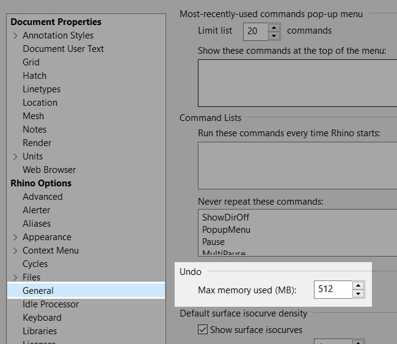

# Troubleshooting Guide

### Nothing to revert?
After some time working in Rhino the undo command might suddenly break. The command line will happily tell you: `Nothing to revert.` – Even tho there _certainly is_ something to be undone.  
The solution here is kinda two-fold:
Check your settings in `General > Undo`, the undo memory might be to low to hold the operations you did previously.  
  

If those operations were quite heavy (e.g. Boolean operations between complicated objects) even with more memory assigned it might be overflown; Rhino will say "Nothing to revert".

Another option to deal with this behaviour is to use the **Incremental Save** command. It's like `SaveAs` except it automatically names the file – but unlike `SaveAs`, it leaves you in your current file. If you ever change your mind you can easily go back to an earlier state of your file.

### Bloated Files
The [McNeel wiki](https://wiki.mcneel.com/rhino/checkreducefilesize) has a good list about all the possibilities why your file might end up being huge (not only, but especially):

- super fine display meshes
- hi-res bitmaps (materials or picture frames)
- large collection of materials
- plug-in data
- plain big data (massive amounts of geometry)

Another reason could be the new Rhino 6 feature called "**Snapshots**". Snapshots basically save the current state of your model (think 'Layer Combinations' from Photoshop, just much more advanced). This includes the position of objects, their parameters, rendering settings etc.

However the caveat is a big increase in file size: My 10 mb file grew to 200 mb after just four snapshots, and finally grew so big after 6 that the PC crashed.
Sadly there seems to be no workaround for that at the moment but not using snapshots all together. (However you might just need to save certain parameters, like the [layers state](./README.md#too-many-layers-to-handle))

To get rid of the snapshots data (and make your files small again) use:  
`-_Snapshots _Delete _All _Enter`

Gladly, this will be fixed in Rhino 7.  
[[source]](https://discourse.mcneel.com/t/why-is-my-file-so-big/66686/)
